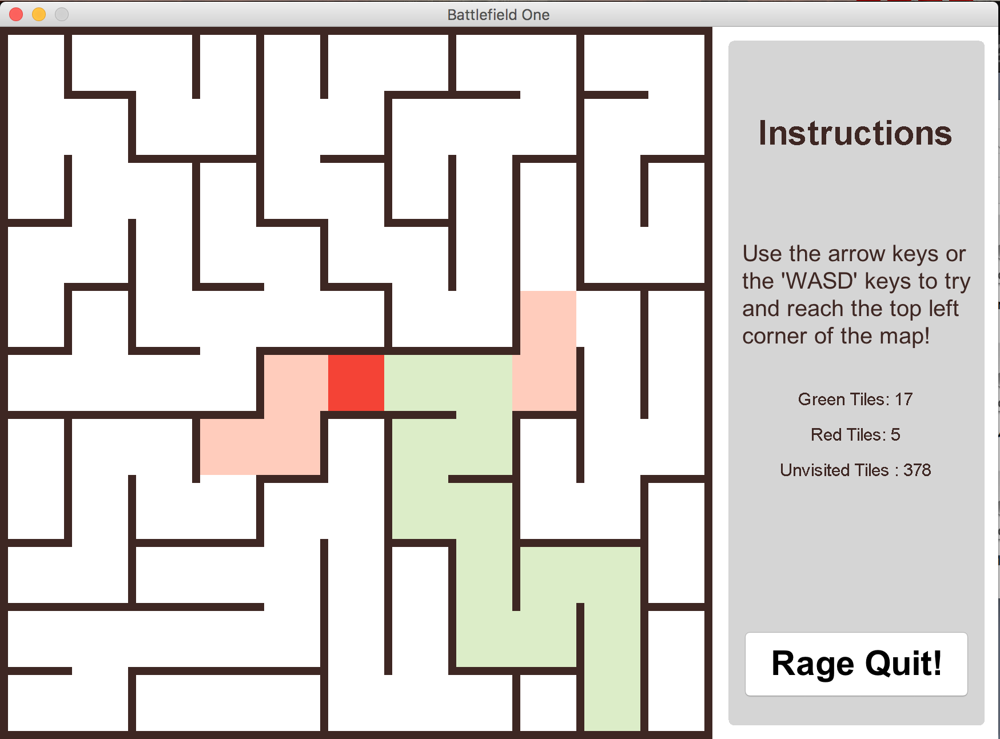

# Java Maze Game

Java maze game with different levels of difficulty.

It uses [recursive backtracking](https://en.wikipedia.org/wiki/Maze_generation_algorithm#Recursive_backtracker) to generate the Maze and gives you performance statistics once you finish the level.

To run: `./run`

To clean up compiled files: `./compile -c`

